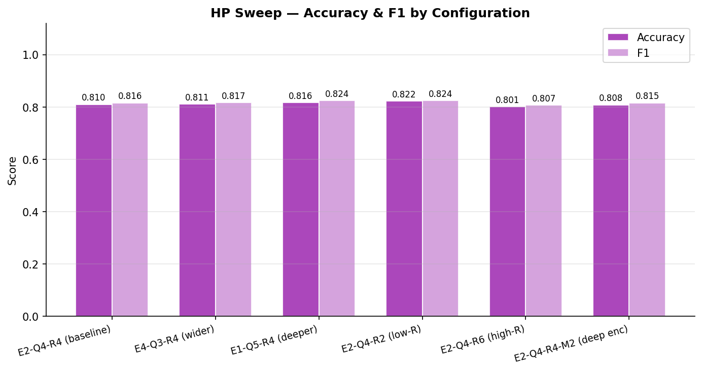

# Hybrid Quantum-Classical NLP Classifier

A prototype of the hybrid quantum-classical classification head from
[_Quantum Large Language Model Fine-Tuning_ (arXiv:2504.08732)](https://arxiv.org/html/2504.08732v1),
benchmarked against classical baselines across two enterprise NLP domains.

---

## Architecture

Text is embedded by a **frozen BGE-base-en-v1.5** language model (768-dim dense
vectors via `sentence-transformers`) run locally, then classified by one of four heads:

```
Input text
    │
    ▼
┌──────────────────────────────────┐
│  BGE-base-en-v1.5  (frozen LLM)  │  768-dim sentence embedding
│  BAAI/bge-base-en-v1.5           │  shared by all models
└────────────────┬─────────────────┘
                 │
     ┌───────────┴────────────┐
     │                        │
     ▼ Quantum Hybrid         ▼ Classical baselines
┌──────────────────┐   ┌─────────────────────────┐
│ Stage 1 — sQE    │   │ Logistic Regression      │
│ E linear proj-   │   │ Linear SVM               │
│ ectors → quantum │   │ MLP  (768 → 32 → 2)      │
│ amplitude embed  │   └─────────────────────────┘
│ → E×Q features   │
├──────────────────┤
│ Stage 2 — PQC    │
│ Data re-uploading│
│ circuit, R rounds│
│ → Q expectations │
├──────────────────┤
│ Linear(Q → 2)    │
└──────────────────┘
```

**Best sweep config (E2-Q4-R2):** ~24,666 total trainable parameters — matched by the
MLP baseline (~24,674) so any accuracy difference reflects the quantum latent-space
transformation, not model capacity.

---

## Results

Models are trained on 500 samples/class and evaluated on a 1,000-sample held-out test
set. The quantum model was selected via an HP sweep; see [Hyperparameter Sweep](#hyperparameter-sweep) for details.

### Clinical — Adverse Drug Event Detection

Pharmaceutical companies and regulators are legally required to monitor post-market
drug safety by scanning a continuous stream of clinical notes, case reports, and
published literature for adverse drug events (ADEs). This is largely manual today:
trained reviewers read individual documents to decide whether a reported outcome is
drug-related. At scale — tens of thousands of documents per year per drug programme —
missed ADEs carry regulatory fines and reputational risk, while false alarms waste
clinician time. An accurate automated classifier reduces reviewer burden, accelerates
signal detection, and quantifiably lowers compliance exposure. Labeled ADE data is
genuinely scarce, which motivates the low-data learning properties that the quantum
approach is designed to exploit.

_Dataset:_ ADE Corpus v2 · binary: _Not ADE-related_ vs _ADE-related_

| Model                     | Accuracy |   F1   | Train (s) |
| ------------------------- | :------: | :----: | :-------: |
| Logistic Regression       |  0.8280  | 0.8359 |   0.01    |
| **Linear SVM** ★          |  0.8500  | 0.8544 |   0.08    |
| MLP                       |  0.8160  | 0.8217 |   5.65    |
| Quantum Hybrid (E2-Q4-R2) |  0.8400  | 0.8459 |   225.8   |


→ [Full clinical benchmark report](outputs/clinical/report.md)

### Financial — News Sentiment

Systematic equity funds consume thousands of news articles, earnings call transcripts,
and social media posts every trading day to inform entry and exit decisions. Manual
analyst coverage at this volume is impossible; automated sentiment classification is
the first filter that routes signals toward or away from trade execution. A false
positive — classifying bearish news as bullish — can trigger a losing long position.
A false negative — missing a genuine bullish signal — is foregone alpha. At 500,000
signals per year and $75k average trade notional, even a one-point improvement in F1
is worth roughly $422k in recovered alpha annually. The challenge is that market
sentiment is subtle and context-dependent: a sentence that reads as positive in one
macroeconomic regime can be bearish in another, making the expressivity of the
classifier's feature space directly material to P&L.

_Dataset:_ Twitter Financial News Sentiment · binary: _Bearish_ vs _Bullish_

| Model                      | Accuracy |   F1   | Train (s) |
| -------------------------- | :------: | :----: | :-------: |
| Logistic Regression        |  0.8080  | 0.8178 |   0.01    |
| Linear SVM                 |  0.8140  | 0.8229 |   0.08    |
| MLP                        |  0.8130  | 0.8176 |   4.65    |
| Quantum Hybrid (E2-Q4-R2)† |  0.8220  | 0.8245 |   178.4   |


> † The quantum model received an HP sweep (6 configs × 50 epochs) before its final
> 100-epoch training run; classical baselines were trained once. The ~1 pp gap is
> within noise and should not be treated as a controlled comparison.

→ [Full financial benchmark report](outputs/financial/report.md)

---

## Hyperparameter Sweep

Six circuit configurations were swept under the constraint **E × 2^Q = 32**, which
fixes the projector at 24,576 parameters across all configs so only circuit-level
parameters (< 300 difference) vary.

**Consistent finding:** reducing re-upload depth from R=4 to R=2 improved accuracy on
both domains; R=6 degraded it. Shallower circuits generalise better at this dataset
scale (~1k training samples), consistent with barren plateau effects in variational
quantum circuits.




→ [Financial sweep report](outputs/financial/hp_sweep/sweep_report.md) ·
[Clinical sweep report](outputs/clinical/hp_sweep/sweep_report.md)

---

## Business Impact Simulations

Inference on genuinely unseen data, with KPIs projected to annual scale.

### Clinical — Pharmacovigilance

50,000 cases/yr · 30% ADE prevalence · $2,800/missed ADE · $120/false alarm

| Model                     | Missed ADEs/yr | Total Cost/yr |
| ------------------------- | :------------: | :-----------: |
| **Logistic Regression** ★ |     1,596      |    $2.74M     |
| Linear SVM                |     2,660      |    $2.98M     |
| Quantum Hybrid            |     2,660      |    $3.11M     |
| MLP                       |     3,191      |    $3.23M     |

A 1 pp F1 improvement is worth ~$84k/yr in avoided regulatory exposure.


→ [Clinical simulation report](simulation/clinical/simulation_report.md)

### Financial — Systematic Equity Fund

500,000 signals/yr · $75k avg trade notional · 40 bps FP loss · 25 bps missed alpha

| Model               | FP Trading Losses | Missed Alpha | Total Cost/yr |
| ------------------- | :---------------: | :----------: | :-----------: |
| Logistic Regression |      $15.38M      |    $2.32M    |    $21.70M    |
| Linear SVM          |      $12.75M      |    $2.64M    |    $19.39M    |
| Quantum Hybrid      |      $14.25M      |    $3.16M    |    $21.41M    |
| **MLP** ★           |      $11.62M      |    $3.38M    |  **$19.00M**  |

A 1 pp F1 improvement is worth ~$422k/yr in captured alpha.


→ [Financial simulation report](simulation/financial/simulation_report.md)

> _KPI assumptions are illustrative. Clinical costs based on FDA enforcement data /
> PhRMA benchmarks (2023). Financial rates consistent with Tetlock 2007 and
> Engelberg & Parsons 2011._

---

## Limitations & Path Forward

The current prototype runs on local CPU simulation with Q=4 qubits — far below the
scale at which the reference paper claims advantage. Conclusions are constrained by:

- **Qubit count:** The reference paper targets 20+ qubits. At Q=4, statevector
  simulation provides no meaningful quantum expressivity benefit over classical layers.
- **Training budget:** The quantum model was HP-swept; classical baselines were not.
  Results cannot be treated as a controlled head-to-head comparison.
- **No hardware noise:** `default.qubit` is ideal and noiseless. Any hardware-native
  regularisation effect is absent.

| Priority | Next step                                                                                                                   |
| -------- | --------------------------------------------------------------------------------------------------------------------------- |
| High     | Re-run on `lightning.gpu` with Q ≥ 12–16 and matched training budgets for all models                                        |
| High     | Apply an equivalent HP sweep to classical baselines before drawing conclusions                                              |
| Medium   | Forward-pass evaluation of trained weights on `ionq.simulator` to quantify the hardware noise gap without gradient overhead |
| Medium   | Scale datasets to 5–10k samples/class                                                                                       |

---

## IonQ Backend — Attempt & Findings

We attempted to run the re-uploading PQC on `ionq.simulator` (trapped-ion noise model)
while keeping the encoder on `default.qubit`, matching the paper's two-backend design.

Training was reverted after it proved impractical: `parameter-shift` gradient
computation requires **2 API calls per trainable weight per sample**. With 96 PQC
weights and batch size 16, each optimizer step dispatches ~3,072 sequential remote
calls — making a 100-epoch run infeasible.

→ Details on errors encountered and the recommended forward-pass-only evaluation path
are in the [IonQ section of the original implementation notes](#ionq-backend--attempt--findings).

---

## Files

| File                               | Purpose                                                                |
| ---------------------------------- | ---------------------------------------------------------------------- |
| `hybrid_classifier.py`             | `MultiEncoderDR`, `ReuploadingPQC`, `HybridQuantumHead`, training loop |
| `data_loader.py`                   | Dataset loaders + BGE embedding cache                                  |
| `classical_baseline.py`            | MLP, Logistic Regression, Linear SVM                                   |
| `benchmark.py`                     | HP sweep, full benchmark, chart + report generation                    |
| `problem_spaces/financial.py`      | Financial sentiment dataset config                                     |
| `problem_spaces/clinical.py`       | ADE detection dataset config                                           |
| `simulation/clinical/run_demo.py`  | Pharmacovigilance KPI simulation                                       |
| `simulation/financial/run_demo.py` | Equity fund KPI simulation                                             |

---

## Running

```bash
myenv\Scripts\activate

# Full benchmark (both domains, includes HP sweep)
python benchmark.py

# Single domain
python benchmark.py financial
python benchmark.py clinical

# Business impact simulations
python simulation/clinical/run_demo.py
python simulation/financial/run_demo.py
```

Outputs: `outputs/{domain}/` (benchmark) · `simulation/{domain}/` (demos)

---

## Dependencies

```
pennylane==0.44.1  pennylane_lightning==0.44.0  PennyLane-IonQ==0.44.0
torch==2.11.0  sentence-transformers==5.3.0  datasets==4.8.4
scikit-learn==1.8.0  matplotlib  seaborn  pandas  numpy  joblib
```
