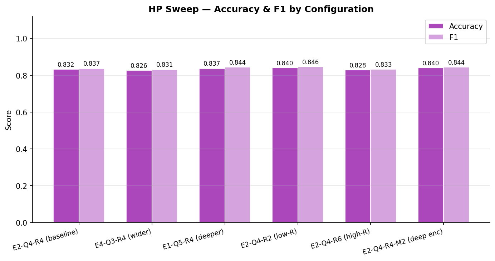
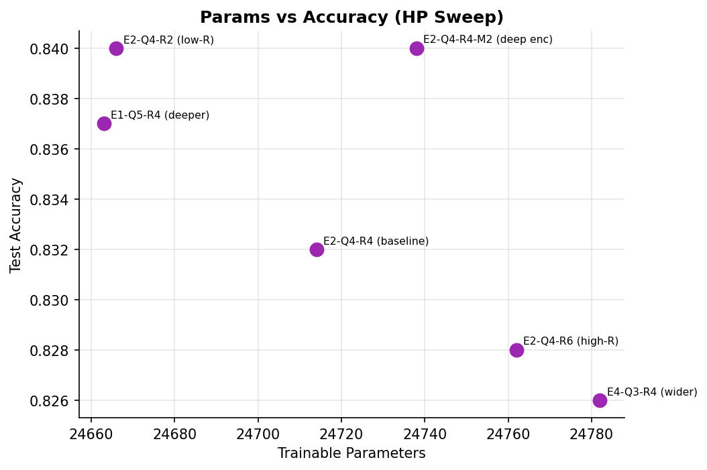
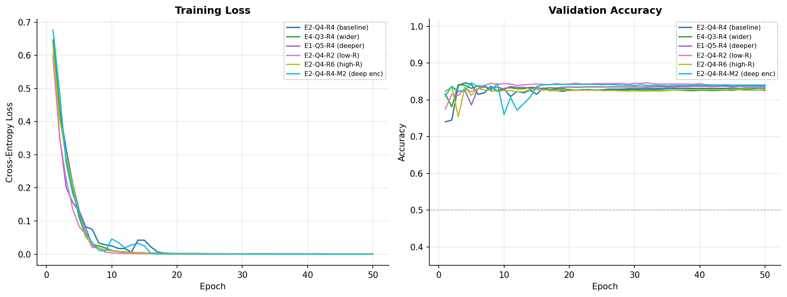
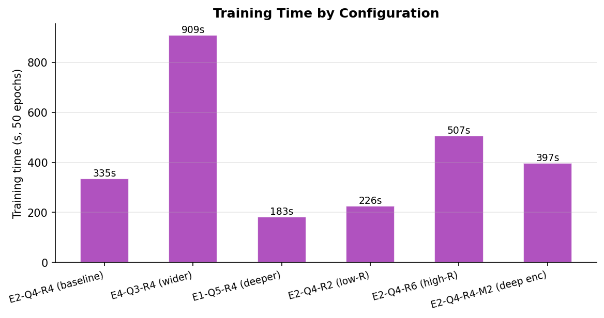

# Hyperparameter Sweep — Hybrid Quantum-Classical Head

_Generated: 2026-04-01 18:33_

---

## Design

- **Constraint**: E × 2^Q = 32 for all configs → projector params fixed at embed_dim × 32. Total params vary by <300 across all configs.
- **Epochs per config**: 50  |  **Batch**: 16  |  **LR**: 0.01
- **Varied axes**: architecture shape (E, Q), re-upload depth (R), encoder circuit depth (M)

## Results

| Config | E | Q | R | M | L | Params | Accuracy | F1 | Train time |
|--------|:-:|:-:|:-:|:-:|:-:|-------:|:--------:|:--:|:----------:|
| E2-Q4-R4 (baseline) | 2 | 4 | 4 | 1 | 1 | 24,714 | 0.8320 | 0.8369 | 334.9s |
| E4-Q3-R4 (wider) | 4 | 3 | 4 | 1 | 1 | 24,782 | 0.8260 | 0.8311 | 908.6s |
| E1-Q5-R4 (deeper) | 1 | 5 | 4 | 1 | 1 | 24,663 | 0.8370 | 0.8440 | 182.9s |
| **E2-Q4-R2 (low-R)** ★ | 2 | 4 | 2 | 1 | 1 | 24,666 | 0.8400 | 0.8459 | 225.8s |
| E2-Q4-R6 (high-R) | 2 | 4 | 6 | 1 | 1 | 24,762 | 0.8280 | 0.8327 | 506.6s |
| E2-Q4-R4-M2 (deep enc) | 2 | 4 | 4 | 2 | 1 | 24,738 | 0.8400 | 0.8438 | 397.0s |

> ★ Best: **E2-Q4-R2 (low-R)**  —  accuracy 0.8400, F1 0.8459

## Charts

### Accuracy & F1 by Config

### Parameter Count vs Accuracy

### Learning Curves

### Training Time

---
_End of sweep report._
