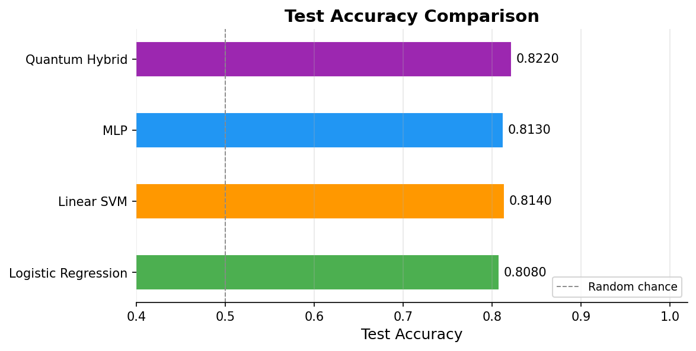
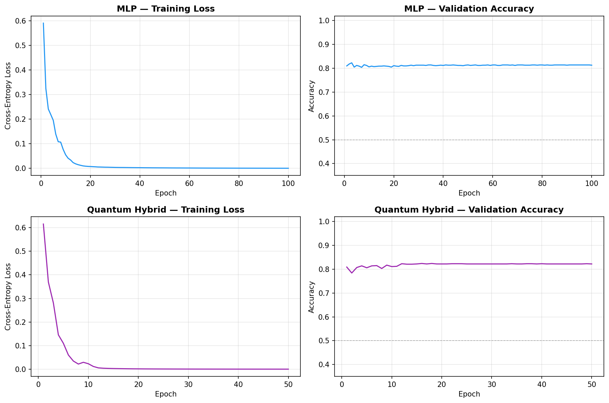
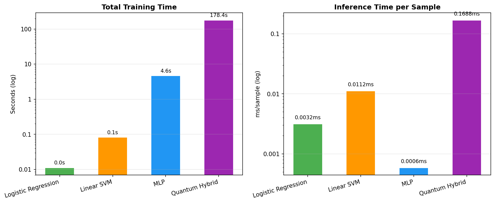
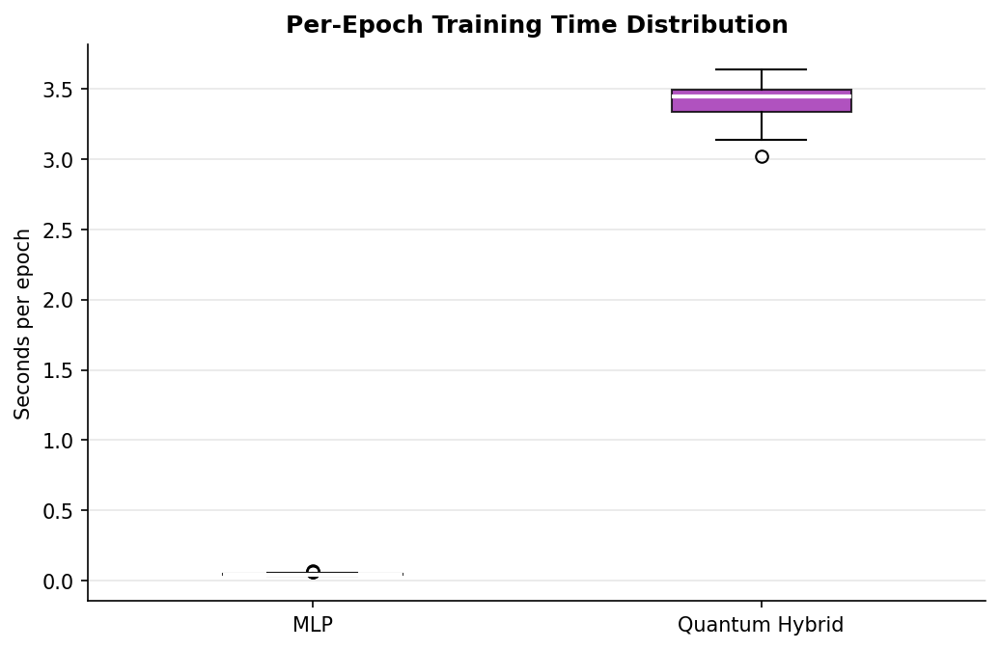
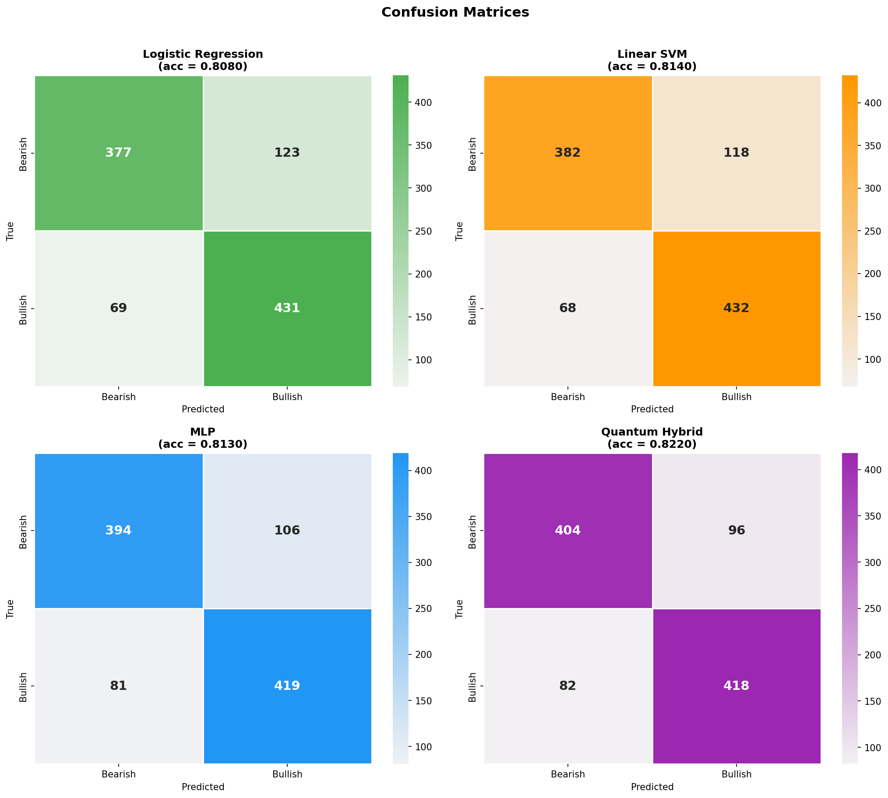
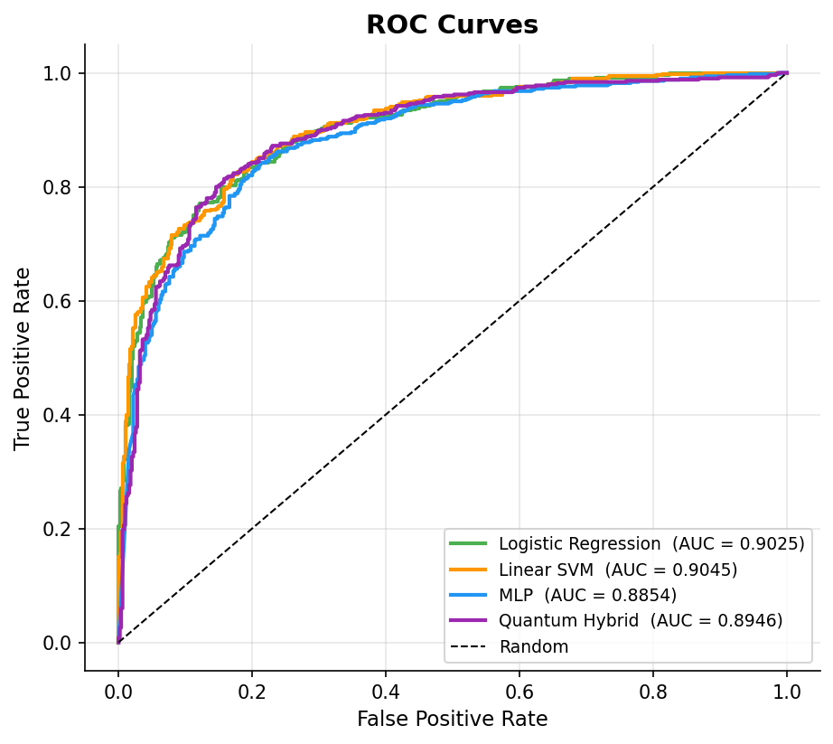

# Financial News Sentiment — Benchmark Report

_Generated: 2026-04-01 17:39_

---

## 1. Overview

Binary sentiment (Bearish vs Bullish) on financial tweets/headlines

- **Features**: BGE-768 sentence embeddings
- **Training set**: 500 samples/class  (see loader for exact split)
- **Test set**: 1000 samples
- **Classes**: Bearish (0) vs Bullish (1)
- **Epochs**: 100  |  **Batch**: 16  |  **LR**: 0.01

---

## 2. Models

| Model | Type | Params | Notes |
|-------|------|--------|-------|
| Logistic Regression | Classical — linear | — | L2-regularised, direct fit on raw features |
| Linear SVM | Classical — linear kernel | — | LinearSVC + Platt calibration for probabilities |
| MLP | Classical — neural | 24,674 | 768→32→2, ReLU; same Adam/LR/epochs as Quantum |
| Quantum Hybrid | Hybrid quantum-classical | 24,666 | Best sweep config: E2-Q4-R2 (low-R) — sQE (2×4q) + PQC (8q, R=2) |

---

## 3. Results

| Model | Accuracy | F1 | Train (s) | Infer (ms/sample) |
|-------|:--------:|:--:|:---------:|:-----------------:|
| Logistic Regression | 0.8080 | 0.8178 | 0.01 | 0.0032 |
| Linear SVM | 0.8140 | 0.8229 | 0.08 | 0.0112 |
| MLP | 0.8130 | 0.8176 | 4.65 | 0.0006 |
| **Quantum Hybrid** ★ | 0.8220 | 0.8245 | 178.39 | 0.1688 |

> ★ Best: **Quantum Hybrid** (0.8220)

---

## 4. Charts

### Accuracy Comparison

### Training Curves

### Runtime

### Epoch Timing Distribution

### Confusion Matrices

### ROC Curves


---

## 5. Classification Reports

### Logistic Regression
```
precision    recall  f1-score   support

     Bearish       0.85      0.75      0.80       500
     Bullish       0.78      0.86      0.82       500

    accuracy                           0.81      1000
   macro avg       0.81      0.81      0.81      1000
weighted avg       0.81      0.81      0.81      1000
```

### Linear SVM
```
precision    recall  f1-score   support

     Bearish       0.85      0.76      0.80       500
     Bullish       0.79      0.86      0.82       500

    accuracy                           0.81      1000
   macro avg       0.82      0.81      0.81      1000
weighted avg       0.82      0.81      0.81      1000
```

### MLP
```
precision    recall  f1-score   support

     Bearish       0.83      0.79      0.81       500
     Bullish       0.80      0.84      0.82       500

    accuracy                           0.81      1000
   macro avg       0.81      0.81      0.81      1000
weighted avg       0.81      0.81      0.81      1000
```

### Quantum Hybrid
```
precision    recall  f1-score   support

     Bearish       0.83      0.81      0.82       500
     Bullish       0.81      0.84      0.82       500

    accuracy                           0.82      1000
   macro avg       0.82      0.82      0.82      1000
weighted avg       0.82      0.82      0.82      1000
```

---

## 6. Discussion

### Runtime overhead of quantum simulation
- **Logistic Regression**: 15922× slower to train, 54× slower per inference sample
- **Linear SVM**: 2170× slower to train, 15× slower per inference sample
- **MLP**: 38× slower to train, 288× slower per inference sample

### MLP as controlled comparison
The MLP uses the same optimiser, LR, batch size, and epoch budget as the quantum head, with a comparable parameter count.  Any accuracy difference reflects the quantum latent-space transformation, not differences in training budget.

_End of report._
