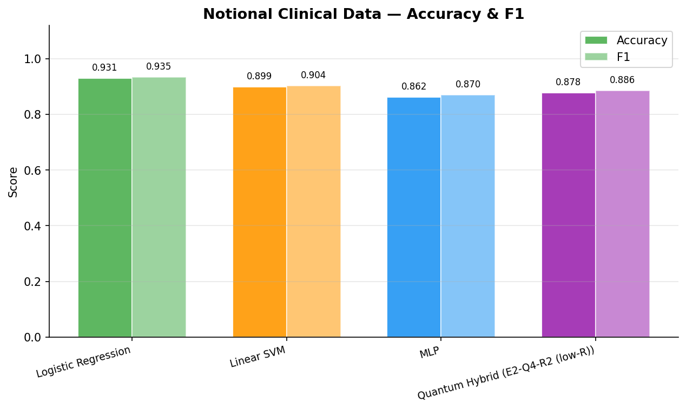
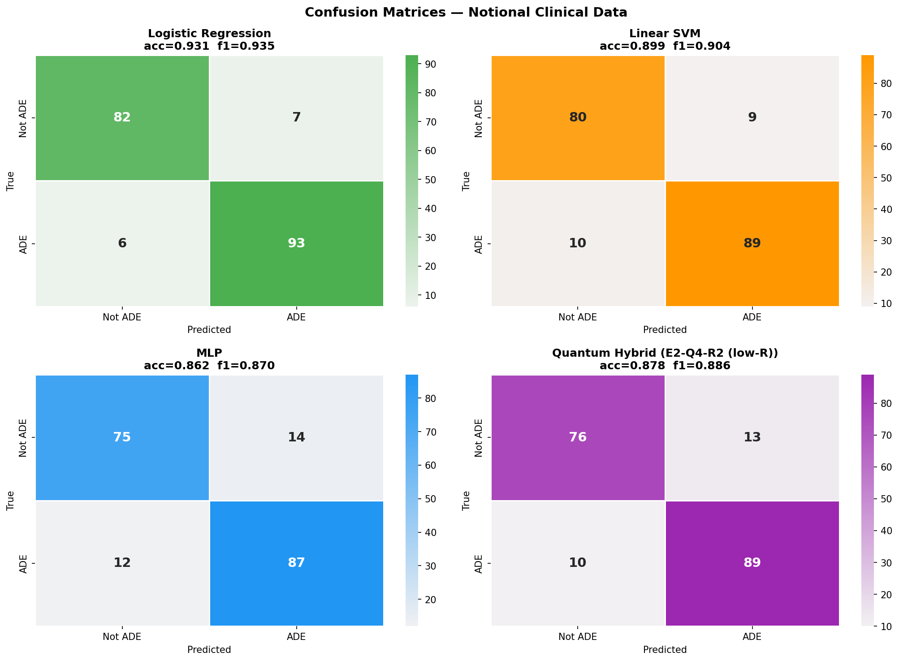
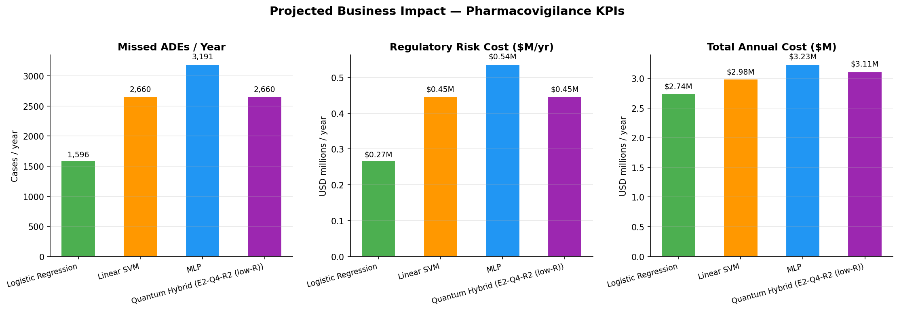
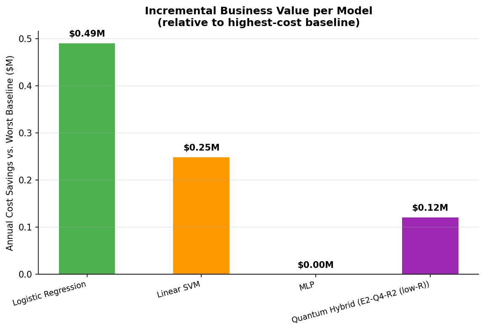

# ADE Detection — Business Impact Simulation

## 1. Data Summary

- **188 notional clinical sentences** (unseen from training)
- **99 ADE-related** / **89 Not ADE-related**
- BGE-base-en-v1.5 (768-dim) embeddings

## 2. Model Performance

| Model | Accuracy | F1 |
|-------|:--------:|:--:|
| **Logistic Regression** ★ | 0.9309 | 0.9347 |
| Linear SVM | 0.8989 | 0.9036 |
| MLP | 0.8617 | 0.8700 |
| Quantum Hybrid (E2-Q4-R2 (low-R)) | 0.8777 | 0.8856 |

> ★ Best: **Logistic Regression**

## 3. Business-Impact Assumptions

| Parameter | Value |
|-----------|-------|
| Annual case volume | 50,000 |
| ADE prevalence | 30% |
| Manual review cost/case | $45 |
| Regulatory cost/missed ADE | $2,800 |
| False-alarm cost | $120 |
| Downstream QA catch rate | 80% |

## 4. Projected Annual KPIs

| Model | Missed ADEs/yr | Regulatory Risk ($M) | False-Alarm Cost ($M) | Total Cost ($M) |
|-------|:--------------:|:--------------------:|:---------------------:|:---------------:|
| **Logistic Regression** | 1,596 | $0.27 | $0.22 | $2.74 |
| Linear SVM | 2,660 | $0.45 | $0.29 | $2.98 |
| MLP | 3,191 | $0.54 | $0.45 | $3.23 |
| Quantum Hybrid (E2-Q4-R2 (low-R)) | 2,660 | $0.45 | $0.41 | $3.11 |

## 5. Executive Summary

- **Logistic Regression** achieves the lowest total annual cost of **$2.74M** (saving **$0.49M/yr** vs MLP).
- The Quantum Hybrid model ranks #3/4 on total cost ($3.11M/yr, 2,660 missed ADEs/yr).
- On this notional dataset classical models achieve higher recall; the quantum advantage is expected to be more pronounced on larger, noisier production corpora.
- At 50,000 cases/year, a **1% F1 improvement** translates to ~$84k USD in avoided regulatory exposure.

## 6. Charts

### Accuracy & F1

### Confusion Matrices

### KPI Comparison

### Savings Waterfall

---
_Assumptions are illustrative. Cost estimates based on FDA enforcement data and PhRMA industry benchmarks (2023)._
