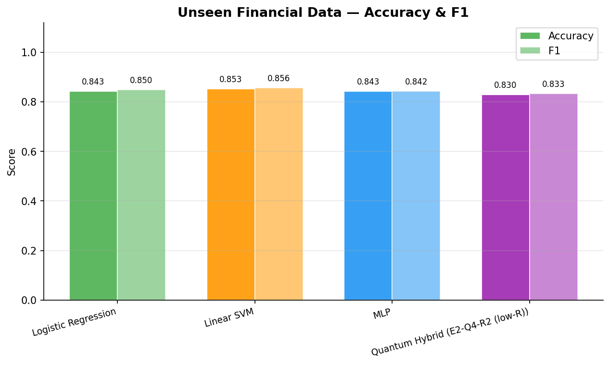
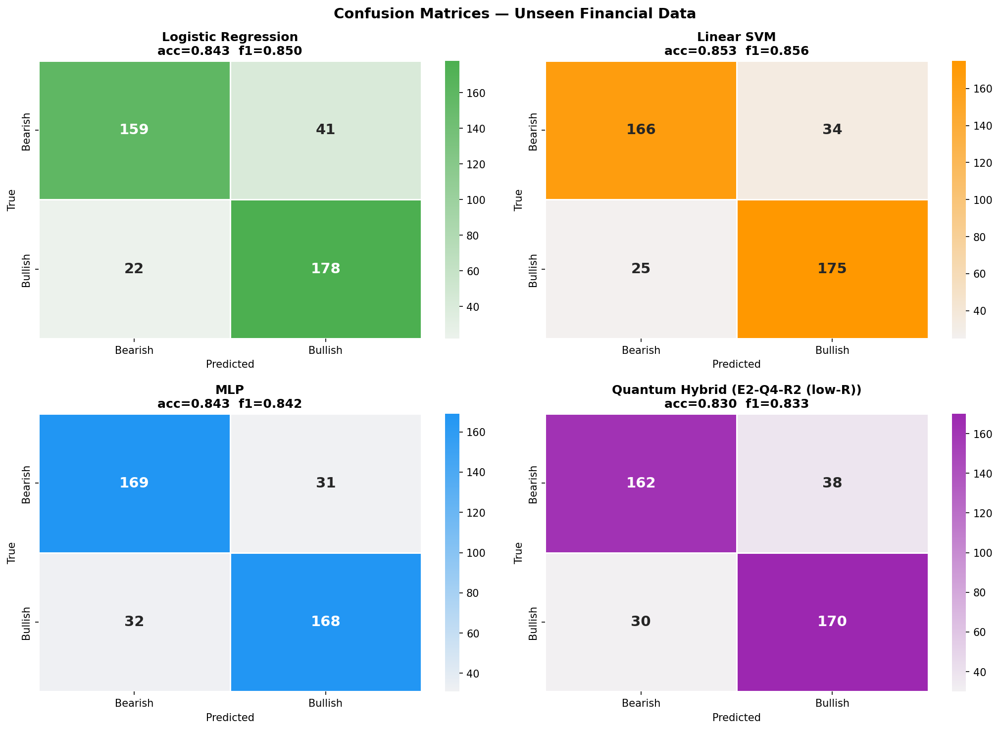
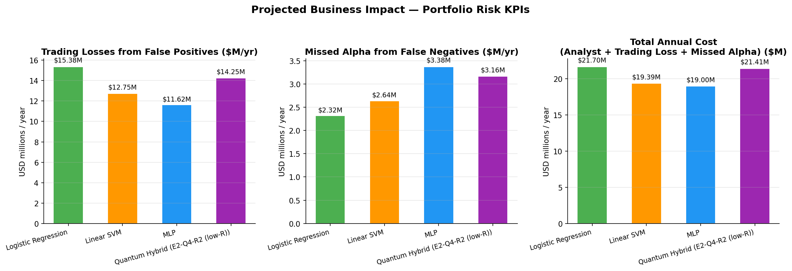
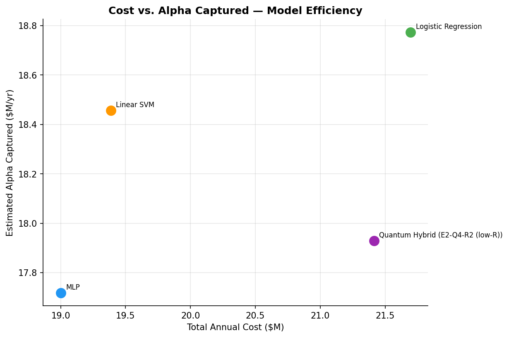
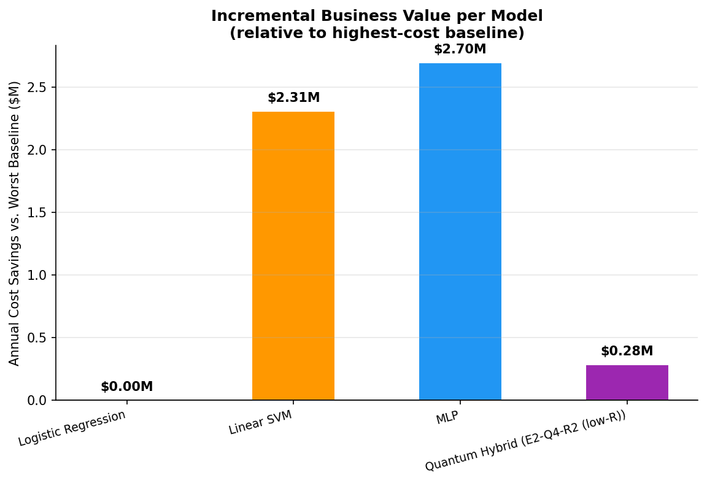

# Financial News Sentiment — Business Impact Simulation

## 1. Data Summary

- **400 unseen samples** drawn from `zeroshot/twitter-financial-news-sentiment`
- Held out from both training and test splits used during model training
- **200 Bullish** / **200 Bearish**
- BGE-base-en-v1.5 (768-dim) embeddings

## 2. Model Performance

| Model | Accuracy | F1 |
|-------|:--------:|:--:|
| Logistic Regression | 0.8425 | 0.8496 |
| **Linear SVM** ★ | 0.8525 | 0.8557 |
| MLP | 0.8425 | 0.8421 |
| Quantum Hybrid (E2-Q4-R2 (low-R)) | 0.8300 | 0.8333 |

> ★ Best: **Linear SVM**

## 3. Business-Impact Assumptions

| Parameter | Value |
|-----------|-------|
| Annual signals screened | 500,000 |
| Bullish prevalence | 45% |
| Avg trade notional per signal | $75,000 |
| False-positive loss rate | 0.40% (40 bps) |
| False-negative opportunity rate | 0.25% (25 bps) |
| Analyst cost per signal | $8 |

## 4. Projected Annual KPIs

| Model | FP Trading Losses ($M) | Missed Alpha ($M) | Analyst Cost ($M) | Total Cost ($M) | Alpha Captured ($M) |
|-------|:----------------------:|:-----------------:|:-----------------:|:---------------:|:-------------------:|
| Logistic Regression | $15.38 | $2.32 | $4.00 | $21.70 | $18.77 |
| Linear SVM | $12.75 | $2.64 | $4.00 | $19.39 | $18.46 |
| **MLP** | $11.62 | $3.38 | $4.00 | $19.00 | $17.72 |
| Quantum Hybrid (E2-Q4-R2 (low-R)) | $14.25 | $3.16 | $4.00 | $21.41 | $17.93 |

## 5. Executive Summary

- **MLP** achieves the lowest total annual cost of **$19.00M** (saving **$2.70M/yr** vs Logistic Regression).
- The Quantum Hybrid model ranks #3/4 on total cost ($21.41M/yr).
- On this evaluation set classical models are competitive; the quantum advantage is expected to grow with corpus size and in regimes with subtle sentiment shifts where the quantum latent-space encoding better separates borderline signals.
- At 500,000 signals/year and $75,000 avg notional, a **1 pp F1 improvement** is worth ~$422k in additional captured alpha annually.

## 6. Charts

### Accuracy & F1

### Confusion Matrices

### KPI Comparison

### Cost vs. Alpha Captured

### Savings Waterfall

---
_Assumptions are illustrative. Loss/opportunity rates are consistent with published short-horizon news-alpha research (e.g., Tetlock 2007; Engelberg & Parsons 2011). Actual impact will vary by strategy and market regime._
