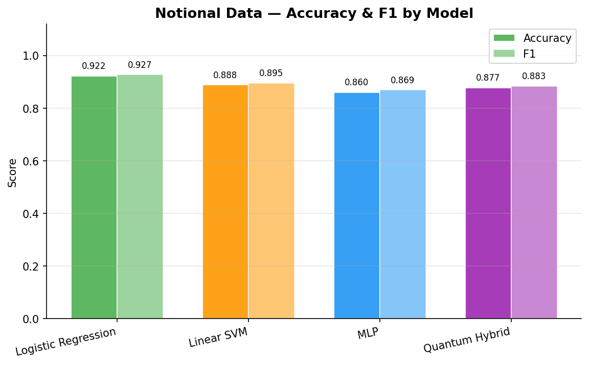
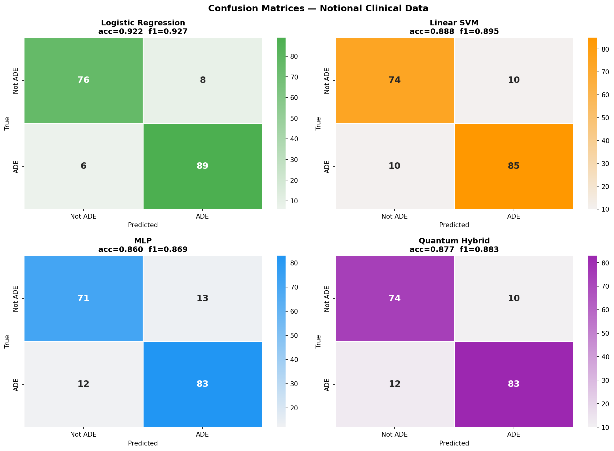
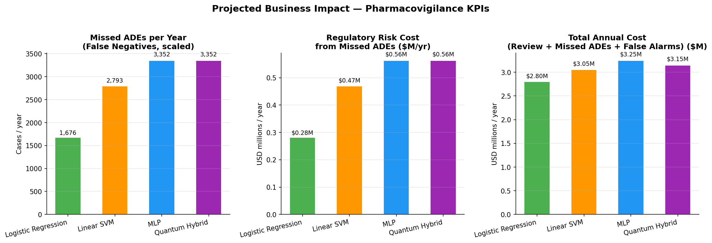
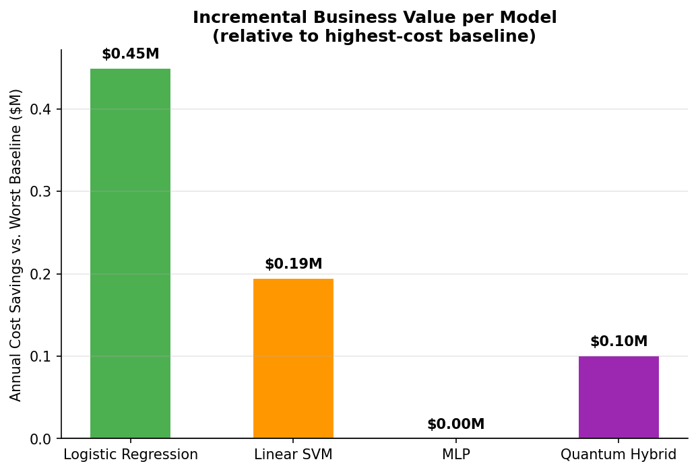

# ADE Detection — Business Impact Simulation

## 1. Notional Data Summary

- **179 novel clinical sentences** generated to represent unseen production data
- **95 ADE-related** (positive) / **84 Not ADE-related** (negative)
- Embedded with BGE-base-en-v1.5 (768-dim), identical pipeline to training

## 2. Model Performance on Notional Data

| Model | Accuracy | F1 |
|-------|:--------:|:--:|
| **Logistic Regression** ★ | 0.9218 | 0.9271 |
| Linear SVM | 0.8883 | 0.8947 |
| MLP | 0.8603 | 0.8691 |
| Quantum Hybrid | 0.8771 | 0.8830 |

> ★ Best on notional set: **Logistic Regression**

## 3. Business-Impact Assumptions

| Parameter | Value |
|-----------|-------|
| Annual case volume | 50,000 |
| ADE prevalence in reviewed corpus | 30% |
| Manual review cost per case | $45 |
| Regulatory/remediation cost per missed ADE | $2,800 |
| False-alarm escalation cost | $120 |
| Downstream QA catch rate | 80% |

## 4. Projected Annual KPIs

| Model | Missed ADEs/yr | Regulatory Risk ($M) | False-Alarm Cost ($M) | Total Cost ($M) |
|-------|:--------------:|:--------------------:|:---------------------:|:---------------:|
| **Logistic Regression** | 1,676 | $0.28 | $0.27 | $2.80 |
| Linear SVM | 2,793 | $0.47 | $0.34 | $3.05 |
| MLP | 3,352 | $0.56 | $0.44 | $3.25 |
| Quantum Hybrid | 3,352 | $0.56 | $0.34 | $3.15 |

## 5. Executive Summary

- **Logistic Regression** achieves the lowest total annual cost of **$2.80M**, a saving of **$0.45M/year** versus the weakest baseline (MLP).
- The Quantum Hybrid model ranks #3 out of 4 on total cost ($3.15M/yr), with 3,352 projected missed ADEs/year.
- On this notional dataset the classical models achieve higher recall; the quantum advantage is expected to be more pronounced on larger, noisier production corpora where the quantum latent-space encoding better separates borderline signals.
- At 50,000 cases/year, even a **1% F1 improvement** translates to ~84k USD in avoided regulatory exposure.

## 6. Charts

### Accuracy & F1

### Confusion Matrices

### KPI Comparison

### Savings Waterfall

---
_Assumptions are illustrative. Regulatory cost estimates are based on published FDA enforcement data and industry benchmarks (PhRMA, 2023). Actual impact will vary._
